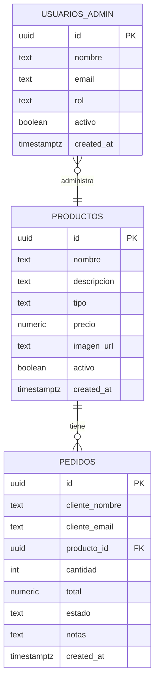

# Tequila El Viejito — Sistema Web

**Proyecto VII (IH739) | Universidad de Guadalajara — Sistema de Universidad Virtual**


---

## 👥 Equipo

| Rol | Integrante |
|-----|------------|
| Product Owner (PO) | Marcela López Núñez |
| Scrum Master (SM) | Aritzai Guadalupe Silva Galván |
| Developer (DEV) | Hiram Agustín Acevedo López |
| Developer (DEV) | Arturo Daniel Aguilar González |

**Asesor:** Sergio Ulises Lillingston Pérez

---

## 🛠️ Stack tecnológico

| Capa | Tecnología | Propósito |
|------|-----------|-----------|
| Frontend | Vue 3 + Vite | UI reactiva y build optimizado |
| Routing | Vue Router 4 | Navegación SPA con lazy-loading |
| Estado | Pinia | Gestión de estado global |
| Backend as a Service | Supabase (PostgreSQL) | Base de datos, Auth y Storage |
| Slider | Swiper.js 11 | Carrusel de productos responsive |
| Calidad de código | ESLint + Prettier | Análisis estático y formato |

---

## 🗄️ Base de datos

El esquema está definido en [`supabase_schema_sprint1.sql`](./supabase_schema_sprint1.sql).
Para aplicarlo: **Supabase → SQL Editor → New query → pegar el archivo → Run**.

### Diagrama entidad-relación



### Tablas

**`productos`** — Catálogo de tequilas disponibles
Tipos válidos: `blanco` · `reposado` · `añejo` · `extra_añejo`

**`pedidos`** — Registro de órdenes de clientes
Estados: `pendiente` → `confirmado` → `enviado` → `entregado` / `cancelado`

**`usuarios_admin`** — Cuentas de administración del sistema
Roles: `admin` · `superadmin`

### Políticas de seguridad (Row Level Security)

| Tabla | Operación | Quién puede |
|-------|-----------|-------------|
| `productos` | SELECT | Cualquier visitante (solo activos) |
| `productos` | INSERT / UPDATE / DELETE | Usuario autenticado |
| `pedidos` | Todas | Solo usuario autenticado |
| `usuarios_admin` | SELECT | Solo el propio usuario (`auth.uid()`) |

---

## 🚀 Roadmap de sprints

| Sprint | Periodo | Alcance | Estado |
|--------|---------|---------|--------|
| 1 | 14 – 20 feb | Infraestructura base, Landing Page, NavBar, schema BD | ✅ Completado |
| 2 | 21 – 27 feb | Sección Nosotros, Contacto + Maps, Footer + RRSS | 🔲 Pendiente |
| 3 | 28 feb – 06 mar | Catálogo de productos desde Supabase, WhatsApp Business | 🔲 Pendiente |
| 4 | 07 – 13 mar | Vista detalle de producto, filtros por categoría y precio | 🔲 Pendiente |
| 5 | 14 – 20 mar | Carrito de compras con persistencia local (MVP pedidos) | 🔲 Pendiente |
| 6 | 21 – 27 mar | Formulario de pedido final, confirmación, compartir en RRSS | 🔲 Pendiente |
| 7 | 28 mar – 13 may | Optimización, pruebas, documentación y despliegue final | 🔲 Pendiente |

---

## 💻 Instalación local

```bash
# 1. Clonar el repositorio
git clone https://github.com/4liyat/IH739_El-viejito.git
cd IH739_El-viejito

# 2. Instalar dependencias
npm install

# 3. Configurar variables de entorno
cp .env.example .env
# Edita .env con tus credenciales de Supabase

# 4. Aplicar el schema en Supabase
# Abre Supabase → SQL Editor → pega el contenido de supabase_schema_sprint1.sql

# 5. Correr en modo desarrollo
npm run dev
```

> El servidor estará disponible en `http://localhost:5173`

---

## 📁 Estructura del proyecto

```
IH739_El-viejito/
├── src/
│   ├── components/
│   │   └── NavBar.vue              # Navegación responsive con hamburguesa
│   ├── lib/
│   │   └── supabaseClient.js       # Cliente Supabase + helpers
│   ├── router/
│   │   └── index.js                # Vue Router — 4 rutas con lazy-loading
│   ├── views/
│   │   ├── HomeView.vue            # Landing: Hero + Slider Swiper + Bienvenida
│   │   ├── NosotrosView.vue        # Sprint 2
│   │   ├── ProductosView.vue       # Sprint 2
│   │   └── ContactoView.vue        # Sprint 2
│   ├── App.vue
│   └── main.js
├── supabase_schema_sprint1.sql     # Schema BD: productos, pedidos, usuarios_admin
├── .env.example                    # Plantilla de variables de entorno
├── vite.config.js
└── package.json
```

---

## 🤝 Contribución

Este proyecto sigue el flujo **fork → branch → pull request**.

```bash
# 1. Haz fork del repositorio y clónalo
git clone https://github.com/TU_USUARIO/IH739_El-viejito.git

# 2. Crea una branch con tu nombre y el sprint
git checkout -b sprint-2-[tu-nombre]

# 3. Desarrolla, commitea y sube
git add .
git commit -m "Sprint 2: descripción de lo que hiciste"
git push origin sprint-2-[tu-nombre]

# 4. Abre un Pull Request hacia main en 4liyat/IH739_El-viejito
```

---

*Licenciatura en Desarrollo de Sistemas Web — UDG Virtual*
